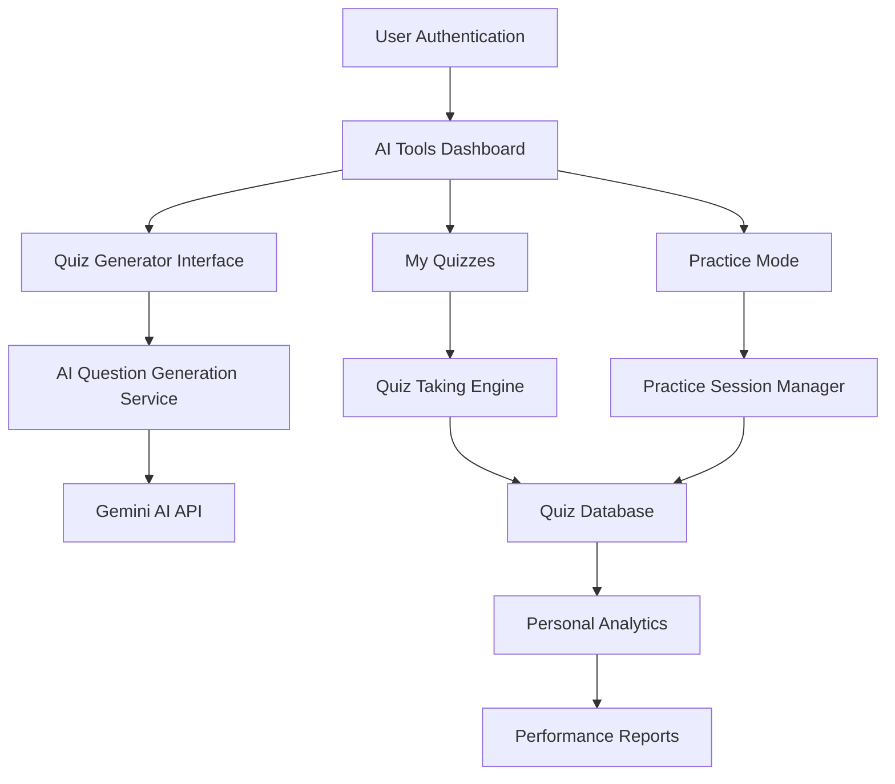

# AI Quiz and Assessment Generator - Design Document

## Overview

The AI Quiz and Assessment Generator is a comprehensive feature that integrates with the existing online learning platform to provide intelligent quiz creation, assessment management, and performance analytics. The system leverages Google Gemini AI for question generation and integrates seamlessly with the current course structure and user management system.

## Architecture

### High-Level Architecture



### System Integration Points

1. **Authentication**: Integrates with existing Clerk authentication (all authenticated users can create/take quizzes)
2. **Database**: Extends current Drizzle ORM schema with quiz-related tables
3. **AI Service**: Utilizes existing Google Gemini AI integration
4. **UI Components**: Leverages existing Radix UI component library
5. **Course System**: Optional connection with existing courses for topic suggestions

## Components and Interfaces

### 1. AI Tools Dashboard (`/workspace/ai-tools`)

**Purpose**: Main landing page for AI-powered tools including quiz generation

**Components**:

- `AIToolsDashboard`: Main container component
- `ToolCard`: Reusable card for each AI tool
- `QuickActions`: Common actions like "Generate Quiz", "Create Assessment"

**Key Features**:

- Tool selection interface
- Recent activity feed
- Quick access to popular features

### 2. Quiz Generator Interface

**Components**:

- `QuizGeneratorForm`: Main form for quiz creation parameters
- `TopicSelector`: Component to select course topics or input custom topics
- `QuestionPreview`: Preview generated questions before saving
- `QuizSettings`: Configuration for difficulty, count, time limits

**Props Interface**:

```typescript
interface QuizGeneratorProps {
  courseId?: string;
  topicId?: string;
  onQuizCreated: (quizId: string) => void;
}

interface QuizSettings {
  title: string;
  description: string;
  questionCount: number;
  difficulty: "beginner" | "intermediate" | "advanced";
  timeLimit: number; // in minutes
  questionTypes: QuestionType[];
  passingScore: number;
}
```

### 3. Quiz Taking Engine

**Components**:

- `QuizTaker`: User interface for taking quizzes
- `QuestionRenderer`: Renders different question types
- `TimerComponent`: Handles quiz timing and auto-submission
- `ResultsDisplay`: Shows quiz results and feedback

**State Management**:

```typescript
interface QuizSession {
  quizId: string;
  userId: string;
  startTime: Date;
  currentQuestion: number;
  answers: Answer[];
  timeRemaining: number;
  isCompleted: boolean;
}
```

### 4. Question Types System

**Supported Question Types**:

- Multiple Choice (single and multiple select)
- True/False
- Short Answer
- Essay Questions
- Fill-in-the-blank
- Matching
- Ordering/Sequencing

**Question Interface**:

```typescript
interface Question {
  id: string;
  type: QuestionType;
  question: string;
  options?: string[]; // for multiple choice
  correctAnswer: string | string[];
  explanation: string;
  difficulty: DifficultyLevel;
  topic: string;
  points: number;
}
```

### 5. Analytics and Reporting

**Components**:

- `PersonalDashboard`: Overview of user's quiz performance
- `QuizHistory`: List of completed quizzes with scores
- `ProgressTracking`: Personal progress tracking over time
- `SimpleReports`: Basic performance summaries

## Data Models

### Database Schema Extensions

```sql
-- Quizzes table
CREATE TABLE quizzes (
  id SERIAL PRIMARY KEY,
  quiz_id VARCHAR UNIQUE NOT NULL,
  title VARCHAR NOT NULL,
  description TEXT,
  course_id VARCHAR REFERENCES courses(cid),
  creator_email VARCHAR REFERENCES users(email),
  settings JSONB NOT NULL,
  questions JSONB NOT NULL,
  is_published BOOLEAN DEFAULT false,
  created_at TIMESTAMP DEFAULT NOW(),
  updated_at TIMESTAMP DEFAULT NOW()
);

-- Quiz attempts table
CREATE TABLE quiz_attempts (
  id SERIAL PRIMARY KEY,
  attempt_id VARCHAR UNIQUE NOT NULL,
  quiz_id VARCHAR REFERENCES quizzes(quiz_id),
  student_email VARCHAR REFERENCES users(email),
  answers JSONB NOT NULL,
  score INTEGER NOT NULL,
  max_score INTEGER NOT NULL,
  start_time TIMESTAMP NOT NULL,
  end_time TIMESTAMP,
  is_completed BOOLEAN DEFAULT false,
  time_taken INTEGER, -- in seconds
  created_at TIMESTAMP DEFAULT NOW()
);

-- Question banks table
CREATE TABLE question_banks (
  id SERIAL PRIMARY KEY,
  bank_id VARCHAR UNIQUE NOT NULL,
  name VARCHAR NOT NULL,
  description TEXT,
  creator_email VARCHAR REFERENCES users(email),
  questions JSONB NOT NULL,
  tags VARCHAR[],
  is_public BOOLEAN DEFAULT false,
  created_at TIMESTAMP DEFAULT NOW()
);

-- Practice sessions table
CREATE TABLE practice_sessions (
  id SERIAL PRIMARY KEY,
  session_id VARCHAR UNIQUE NOT NULL,
  student_email VARCHAR REFERENCES users(email),
  topic VARCHAR NOT NULL,
  questions_answered INTEGER DEFAULT 0,
  correct_answers INTEGER DEFAULT 0,
  session_data JSONB,
  created_at TIMESTAMP DEFAULT NOW(),
  updated_at TIMESTAMP DEFAULT NOW()
);
```

### Drizzle Schema Definitions

```javascript
export const quizzesTable = pgTable("quizzes", {
  id: integer().primaryKey().generatedAlwaysAsIdentity(),
  quizId: varchar("quiz_id").notNull().unique(),
  title: varchar().notNull(),
  description: text(),
  courseId: varchar("course_id").references(() => coursesTable.cid),
  creatorEmail: varchar("creator_email").references(() => usersTable.email),
  settings: json().notNull(),
  questions: json().notNull(),
  isPublished: boolean().default(false),
  createdAt: timestamp().defaultNow(),
  updatedAt: timestamp().defaultNow(),
});

export const quizAttemptsTable = pgTable("quiz_attempts", {
  id: integer().primaryKey().generatedAlwaysAsIdentity(),
  attemptId: varchar("attempt_id").notNull().unique(),
  quizId: varchar("quiz_id").references(() => quizzesTable.quizId),
  studentEmail: varchar("student_email").references(() => usersTable.email),
  answers: json().notNull(),
  score: integer().notNull(),
  maxScore: integer().notNull(),
  startTime: timestamp().notNull(),
  endTime: timestamp(),
  isCompleted: boolean().default(false),
  timeTaken: integer(), // in seconds
  createdAt: timestamp().defaultNow(),
});
```

## Error Handling

### AI Generation Errors

- **Timeout Handling**: Implement retry logic for AI API calls
- **Invalid Response**: Fallback to template questions if AI fails
- **Rate Limiting**: Queue system for multiple simultaneous requests

### Quiz Taking Errors

- **Connection Loss**: Auto-save progress and resume capability
- **Time Expiry**: Graceful handling of time limits with warnings
- **Invalid Submissions**: Validation and error messaging

### Data Integrity

- **Concurrent Access**: Handle multiple students taking same quiz
- **Answer Validation**: Server-side validation of all submissions
- **Score Calculation**: Redundant scoring mechanisms

## Testing Strategy

### Unit Testing

- Question generation logic
- Scoring algorithms
- Timer functionality
- Data validation

### Integration Testing

- AI API integration
- Database operations
- Authentication flow
- Course integration

### End-to-End Testing

- Complete quiz creation workflow
- Student quiz-taking experience
- Results and analytics display
- Performance under load

### Accessibility Testing

- Screen reader compatibility
- Keyboard navigation
- Color contrast compliance
- Mobile responsiveness

## Security Considerations

### Quiz Integrity

- Question randomization
- Answer shuffling
- Time-based tokens
- Session validation

### Data Protection

- Encrypted answer storage
- Secure API endpoints
- Input sanitization
- SQL injection prevention

### Access Control

- User authentication required
- Users can only access their own quizzes and attempts
- Public quiz sharing (optional)
- Personal data privacy

## Performance Optimization

### AI Generation

- Caching frequently requested topics
- Batch question generation
- Asynchronous processing
- Progress indicators

### Quiz Delivery

- Lazy loading of questions
- Optimized database queries
- CDN for static assets
- Real-time updates

### Analytics

- Aggregated data caching
- Background report generation
- Efficient data structures
- Pagination for large datasets

## Scalability Considerations

### Database Design

- Indexed queries for performance
- Partitioning for large datasets
- Read replicas for analytics
- Connection pooling

### API Design

- RESTful endpoints
- Pagination support
- Rate limiting
- Caching strategies

### Frontend Architecture

- Component reusability
- State management optimization
- Code splitting
- Progressive loading
