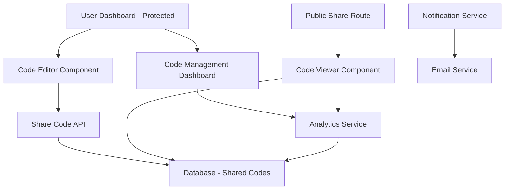
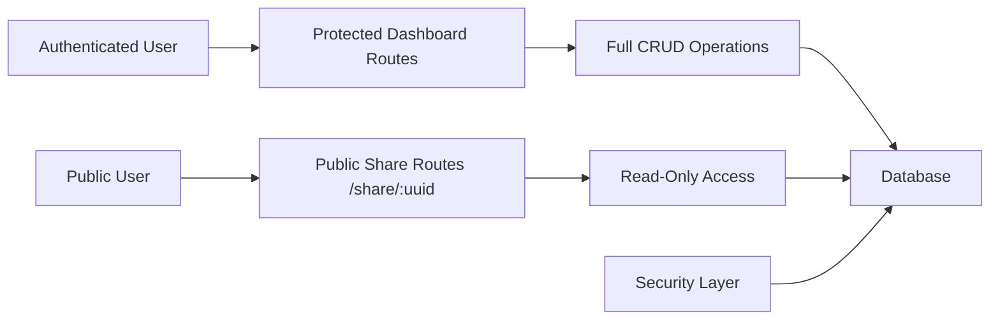

# Code Sharing Portal - Design Document

## Overview

The Code Sharing Portal is a secure code sharing system that allows authenticated users to share code snippets through public links while maintaining dashboard security. The system uses a dual-architecture approach: authenticated users access the full IDE and management features through the protected dashboard, while shared code is accessible via public routes that don't require authentication.

## Architecture

### High-Level Architecture



### Security Architecture



## Components and Interfaces

### 1. Code Editor Component (`CodeEditor.jsx`)

**Purpose:** Integrated Monaco Editor for code writing and editing

**Props:**
- `language`: Programming language for syntax highlighting
- `value`: Current code content
- `onChange`: Callback for code changes
- `theme`: Editor theme (dark/light)
- `readOnly`: Boolean for read-only mode

**Features:**
- Auto-save functionality
- Multi-language support
- Customizable themes
- Code formatting
- Find and replace

### 2. Code Share Modal (`CodeShareModal.jsx`)

**Purpose:** Modal for configuring and generating shareable links

**Props:**
- `code`: Code content to share
- `language`: Programming language
- `onShare`: Callback when share is created
- `isOpen`: Modal visibility state

**Features:**
- Title and description input
- Expiration date selection
- Privacy settings (public/unlisted)
- Password protection option
- Category and tags selection

### 3. Public Code Viewer (`PublicCodeViewer.jsx`)

**Purpose:** Public interface for viewing shared code

**Props:**
- `shareId`: UUID of the shared code
- `embedded`: Boolean for embedded view mode

**Features:**
- Syntax highlighting
- Copy to clipboard
- Download code file
- View analytics (for owner)
- Comment system (if enabled)

### 4. Code Management Dashboard (`CodeManagement.jsx`)

**Purpose:** Dashboard for managing all shared codes

**Features:**
- List all shared codes
- Search and filter functionality
- Analytics overview
- Bulk operations
- Link management

### 5. Share Analytics Component (`ShareAnalytics.jsx`)

**Purpose:** Display analytics for shared code

**Features:**
- View count tracking
- Geographic distribution
- Access timeline
- Referrer tracking
- Export analytics data

## Data Models

### SharedCode Model

```javascript
{
  id: UUID, // Primary key
  shareId: UUID, // Public identifier for sharing
  userId: String, // Owner's user ID
  title: String,
  description: String,
  code: Text, // The actual code content
  language: String, // Programming language
  category: String,
  tags: Array<String>,
  isPublic: Boolean,
  isPasswordProtected: Boolean,
  passwordHash: String, // If password protected
  expiresAt: DateTime,
  allowComments: Boolean,
  allowForking: Boolean,
  viewCount: Number,
  createdAt: DateTime,
  updatedAt: DateTime,
  lastViewedAt: DateTime
}
```

### ShareAnalytics Model

```javascript
{
  id: UUID,
  shareId: UUID, // Foreign key to SharedCode
  viewerIP: String, // Hashed for privacy
  userAgent: String,
  referrer: String,
  country: String, // From IP geolocation
  viewedAt: DateTime,
  sessionDuration: Number // In seconds
}
```

### ShareComment Model

```javascript
{
  id: UUID,
  shareId: UUID, // Foreign key to SharedCode
  commenterName: String,
  commenterEmail: String, // Optional
  comment: Text,
  isApproved: Boolean,
  createdAt: DateTime,
  approvedAt: DateTime
}
```

## API Endpoints

### Protected Routes (Require Authentication)

#### POST `/api/code/share`
Create a new shared code snippet
```javascript
Request: {
  title: String,
  description: String,
  code: String,
  language: String,
  category: String,
  tags: Array<String>,
  isPublic: Boolean,
  expiresAt: DateTime,
  allowComments: Boolean,
  password?: String
}
Response: {
  success: Boolean,
  shareId: UUID,
  shareUrl: String
}
```

#### GET `/api/code/my-shares`
Get all shared codes for authenticated user
```javascript
Response: {
  success: Boolean,
  shares: Array<SharedCode>,
  totalCount: Number
}
```

#### PUT `/api/code/share/:shareId`
Update a shared code snippet
```javascript
Request: {
  title?: String,
  description?: String,
  code?: String,
  expiresAt?: DateTime
}
```

#### DELETE `/api/code/share/:shareId`
Delete a shared code snippet

#### GET `/api/code/share/:shareId/analytics`
Get analytics for a specific shared code

### Public Routes (No Authentication Required)

#### GET `/api/public/code/:shareId`
Get shared code content for public viewing
```javascript
Response: {
  success: Boolean,
  code: {
    title: String,
    description: String,
    code: String,
    language: String,
    category: String,
    tags: Array<String>,
    createdAt: DateTime,
    allowComments: Boolean
  }
}
```

#### POST `/api/public/code/:shareId/view`
Track a view for analytics

#### POST `/api/public/code/:shareId/comment`
Add a comment to shared code (if enabled)

## Database Schema

### Tables

1. **shared_codes**
   - Primary table for storing shared code snippets
   - Indexed on shareId, userId, createdAt, expiresAt

2. **share_analytics**
   - Analytics data for shared codes
   - Partitioned by date for performance
   - Indexed on shareId, viewedAt

3. **share_comments**
   - Comments on shared codes
   - Indexed on shareId, createdAt, isApproved

## Security Implementation

### 1. Link Generation
- Use `crypto.randomUUID()` for generating secure share IDs
- Implement rate limiting on share creation (max 10 shares per hour per user)
- Validate all input data and sanitize code content

### 2. Public Access Security
- Public routes completely isolated from authenticated routes
- No user information exposed in public APIs
- Implement CORS properly for public endpoints
- Rate limiting on public endpoints to prevent abuse

### 3. Password Protection
- Use bcrypt for password hashing
- Implement secure password verification
- Session-based access for password-protected shares

### 4. Content Security
- Sanitize code content to prevent XSS
- Implement content-type validation
- File size limits for shared code
- Malware scanning for uploaded content

## User Interface Design

### 1. Code Editor Interface (Protected Dashboard)
- Full-screen code editor with Monaco
- Language selector dropdown
- Share button prominently displayed
- Auto-save indicator
- Theme toggle (dark/light)

### 2. Share Configuration Modal
- Clean, intuitive form design
- Real-time preview of share settings
- Copy link button with success feedback
- Advanced options collapsible section

### 3. Public Code Viewer
- Clean, distraction-free interface
- Syntax highlighting matching the editor
- Copy button with one-click functionality
- Responsive design for mobile viewing
- Optional branding footer

### 4. Code Management Dashboard
- Table/grid view of all shared codes
- Search and filter capabilities
- Quick actions (copy link, delete, edit)
- Analytics summary cards
- Bulk selection and operations

## Performance Considerations

### 1. Caching Strategy
- Redis caching for frequently accessed shared codes
- CDN for static assets and public code viewer
- Browser caching headers for public content
- Database query optimization with proper indexing

### 2. Scalability
- Horizontal scaling for public viewer endpoints
- Database sharding by user ID for shared codes
- Async processing for analytics data
- Queue system for email notifications

### 3. Monitoring
- Real-time monitoring of public endpoint performance
- Analytics on share creation and viewing patterns
- Error tracking and alerting
- Performance metrics dashboard

## Integration Points

### 1. Learning Platform Integration
- Direct sharing from assignment submissions
- Course-specific sharing categories
- Instructor access to student shared codes
- Academic integrity tracking

### 2. Notification System
- Email notifications for new comments
- Share expiration warnings
- Security alerts for suspicious activity
- Weekly analytics summaries

### 3. Analytics Integration
- Google Analytics for public page views
- Custom analytics dashboard
- Export capabilities for data analysis
- Privacy-compliant tracking

## Mobile Responsiveness

### 1. Code Editor (Mobile)
- Touch-optimized Monaco editor
- Collapsible toolbar
- Gesture support for navigation
- Optimized keyboard layout

### 2. Public Viewer (Mobile)
- Responsive code display
- Touch-friendly copy button
- Optimized font sizes
- Horizontal scrolling for long lines

## Accessibility

### 1. Code Editor Accessibility
- Keyboard navigation support
- Screen reader compatibility
- High contrast themes
- Font size customization

### 2. Public Viewer Accessibility
- ARIA labels for all interactive elements
- Keyboard navigation
- Alt text for visual elements
- Color contrast compliance

## Testing Strategy

### 1. Unit Testing
- Component testing with Jest and React Testing Library
- API endpoint testing
- Database model testing
- Security function testing

### 2. Integration Testing
- End-to-end sharing workflow
- Public access testing
- Authentication boundary testing
- Cross-browser compatibility

### 3. Security Testing
- Penetration testing for public endpoints
- Authentication bypass testing
- Input validation testing
- Rate limiting verification

### 4. Performance Testing
- Load testing for public viewer
- Database performance testing
- CDN performance validation
- Mobile performance testing