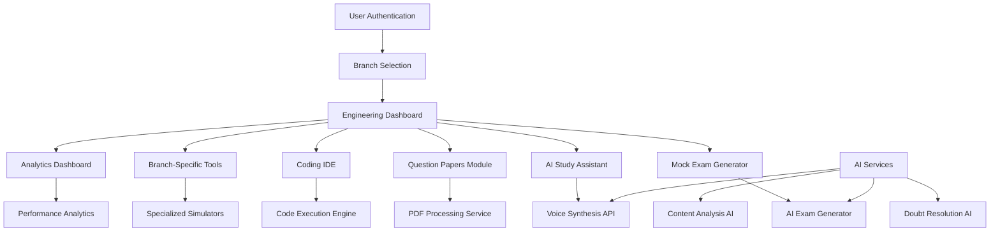
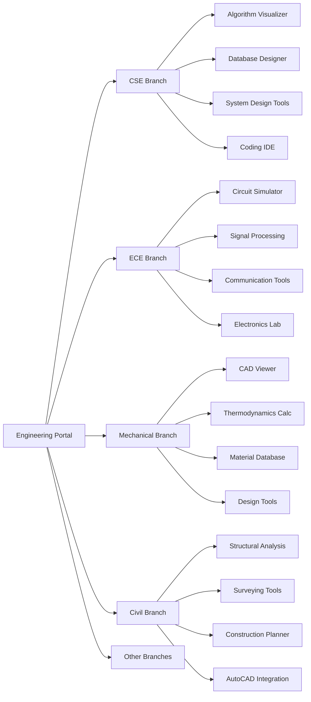

# Engineering Portal Transformation - Design Document

## Overview

This design outlines the transformation of the existing online learning platform into a comprehensive AI-powered engineering education hub. The system will provide branch-specific content, previous year question papers, mock exams, coding practice, and advanced study tools tailored for engineering students.

## Architecture

### High-Level System Architecture



### Branch-Specific Architecture



## Components and Interfaces

### 1. Branch Management System

**Components:**
- `BranchSelector`: Initial branch selection interface
- `BranchDashboard`: Branch-specific dashboard
- `SubjectManager`: Subject organization per branch
- `ProgressTracker`: Branch-specific progress tracking

**Database Schema:**
```sql
-- Engineering branches
CREATE TABLE engineering_branches (
  id SERIAL PRIMARY KEY,
  branch_code VARCHAR(10) UNIQUE NOT NULL,
  branch_name VARCHAR(100) NOT NULL,
  description TEXT,
  subjects JSONB,
  created_at TIMESTAMP DEFAULT NOW()
);

-- User branch enrollments
CREATE TABLE user_branches (
  id SERIAL PRIMARY KEY,
  user_email VARCHAR REFERENCES users(email),
  branch_code VARCHAR REFERENCES engineering_branches(branch_code),
  enrollment_date TIMESTAMP DEFAULT NOW(),
  is_primary BOOLEAN DEFAULT false
);

-- Subjects per branch
CREATE TABLE branch_subjects (
  id SERIAL PRIMARY KEY,
  branch_code VARCHAR REFERENCES engineering_branches(branch_code),
  subject_code VARCHAR(20) NOT NULL,
  subject_name VARCHAR(200) NOT NULL,
  semester INTEGER,
  credits INTEGER,
  is_core BOOLEAN DEFAULT true
);
```

### 2. Question Papers Management

**Components:**
- `QuestionPaperUploader`: Admin interface for uploading papers
- `PaperViewer`: PDF viewer with annotations
- `PaperConverter`: Convert PDFs to interactive quizzes
- `PaperSearch`: Advanced search and filtering

**Features:**
- OCR for scanned papers
- Automatic question extraction
- Year-wise organization
- University-specific categorization

### 3. Mock Exam Generator

**Components:**
- `ExamPatternAnalyzer`: Analyze previous year patterns
- `MockExamBuilder`: Create exams based on patterns
- `ExamSimulator`: Timed exam environment
- `ResultAnalyzer`: Detailed performance analysis

**AI Integration:**
```javascript
// Mock exam generation logic
const generateMockExam = async (branch, subject, examType) => {
  const patterns = await analyzeExamPatterns(branch, subject, 10); // Last 10 years
  const questions = await generateSimilarQuestions(patterns);
  const exam = await createExamStructure(questions, patterns.timeLimit);
  return exam;
};
```

### 4. PDF Voice Reader System

**Components:**
- `PDFProcessor`: Extract text from PDFs
- `VoiceSynthesizer`: Convert text to speech
- `AudioPlayer`: Playback controls
- `BookmarkManager`: Save listening positions

**Technical Implementation:**
```javascript
// Voice reading implementation
class PDFVoiceReader {
  constructor() {
    this.speechSynthesis = window.speechSynthesis;
    this.currentUtterance = null;
  }
  
  async readPDF(pdfFile) {
    const text = await this.extractTextFromPDF(pdfFile);
    const processedText = this.preprocessTechnicalText(text);
    this.speakText(processedText);
  }
  
  preprocessTechnicalText(text) {
    // Handle mathematical expressions, formulas, and technical terms
    return text.replace(/∫/g, 'integral')
               .replace(/∂/g, 'partial derivative')
               .replace(/Σ/g, 'summation');
  }
}
```

### 5. Integrated Development Environment

**Components:**
- `CodeEditor`: Monaco-based code editor
- `CompilerService`: Multi-language compilation
- `TestRunner`: Automated testing framework
- `AICodeAssistant`: Code suggestions and debugging

**Supported Languages:**
- C/C++
- Java
- Python
- JavaScript
- MATLAB (for engineering calculations)

### 6. Branch-Specific Tools

#### CSE/IT Tools:
- **Algorithm Visualizer**: Interactive algorithm demonstrations
- **Database Designer**: ER diagram creator and SQL generator
- **System Design Canvas**: Distributed system design tool
- **API Testing Suite**: REST API testing environment

#### ECE Tools:
- **Circuit Simulator**: SPICE-based circuit analysis
- **Signal Processing Lab**: FFT, filtering, and analysis tools
- **Communication System Simulator**: Modulation/demodulation demos
- **Microcontroller Emulator**: 8051/ARM simulation

#### Mechanical Tools:
- **Thermodynamics Calculator**: Cycle analysis and calculations
- **Material Property Database**: Comprehensive material data
- **CAD File Viewer**: 3D model visualization
- **Fluid Dynamics Simulator**: CFD visualization tools

#### Civil Tools:
- **Structural Analysis Tool**: Beam and truss analysis
- **Surveying Calculator**: Theodolite and GPS calculations
- **Construction Project Planner**: Timeline and resource management
- **Building Code Checker**: Compliance verification

### 7. AI-Powered Resume Analysis and Job Matching System

**Components:**
- `ResumeUploader`: Secure resume upload interface
- `ResumeParser`: AI-powered resume text extraction and analysis
- `SkillExtractor`: Extract technical and soft skills from resume
- `JobScraper`: LinkedIn and job portal integration
- `MatchingEngine`: AI-based job-profile compatibility scoring
- `CareerAdvisor`: Personalized career guidance system

**Technical Implementation:**
```javascript
// Resume analysis workflow
class ResumeAnalyzer {
  async analyzeResume(resumeFile) {
    const extractedText = await this.extractTextFromPDF(resumeFile);
    const structuredData = await this.parseResumeStructure(extractedText);
    const skills = await this.extractSkills(structuredData);
    const experience = await this.analyzeExperience(structuredData);
    const recommendations = await this.generateRecommendations(skills, experience);
    
    return {
      personalInfo: structuredData.personal,
      skills: skills,
      experience: experience,
      education: structuredData.education,
      projects: structuredData.projects,
      recommendations: recommendations
    };
  }
  
  async matchJobs(profile, preferences) {
    const jobListings = await this.scrapeJobPortals(preferences);
    const matches = await this.calculateCompatibility(profile, jobListings);
    return this.rankAndFilterJobs(matches);
  }
}
```

**Job Scraping Integration:**
```javascript
// LinkedIn and job portal scraping
class JobScraper {
  async scrapeLinkedInJobs(keywords, location, experience) {
    // Use LinkedIn API or web scraping (respecting rate limits)
    const jobs = await this.fetchFromLinkedIn({
      keywords: keywords.join(' OR '),
      location: location,
      experienceLevel: experience,
      datePosted: 'week'
    });
    
    return this.normalizeJobData(jobs);
  }
  
  async scrapeMultiplePortals(criteria) {
    const portals = ['linkedin', 'naukri', 'indeed', 'glassdoor'];
    const results = await Promise.all(
      portals.map(portal => this.scrapePortal(portal, criteria))
    );
    
    return this.deduplicateAndMerge(results);
  }
}
```

## Data Models

### Extended Database Schema

```sql
-- Question papers
CREATE TABLE question_papers (
  id SERIAL PRIMARY KEY,
  paper_id VARCHAR UNIQUE NOT NULL,
  branch_code VARCHAR REFERENCES engineering_branches(branch_code),
  subject_code VARCHAR NOT NULL,
  university VARCHAR(200),
  exam_year INTEGER NOT NULL,
  exam_type VARCHAR(50), -- semester, annual, supplementary
  pdf_url VARCHAR NOT NULL,
  extracted_questions JSONB,
  difficulty_level VARCHAR(20),
  total_marks INTEGER,
  duration_minutes INTEGER,
  upload_date TIMESTAMP DEFAULT NOW()
);

-- Mock exams
CREATE TABLE mock_exams (
  id SERIAL PRIMARY KEY,
  exam_id VARCHAR UNIQUE NOT NULL,
  title VARCHAR(200) NOT NULL,
  branch_code VARCHAR REFERENCES engineering_branches(branch_code),
  subject_code VARCHAR NOT NULL,
  based_on_years INTEGER[], -- Array of years used for pattern
  questions JSONB NOT NULL,
  total_marks INTEGER,
  duration_minutes INTEGER,
  created_by VARCHAR REFERENCES users(email),
  created_at TIMESTAMP DEFAULT NOW()
);

-- Mock exam attempts
CREATE TABLE mock_exam_attempts (
  id SERIAL PRIMARY KEY,
  attempt_id VARCHAR UNIQUE NOT NULL,
  exam_id VARCHAR REFERENCES mock_exams(exam_id),
  user_email VARCHAR REFERENCES users(email),
  answers JSONB NOT NULL,
  score INTEGER,
  percentage DECIMAL(5,2),
  time_taken INTEGER, -- in seconds
  started_at TIMESTAMP,
  completed_at TIMESTAMP,
  analysis JSONB -- Detailed performance analysis
);

-- Code submissions
CREATE TABLE code_submissions (
  id SERIAL PRIMARY KEY,
  submission_id VARCHAR UNIQUE NOT NULL,
  user_email VARCHAR REFERENCES users(email),
  problem_id VARCHAR NOT NULL,
  language VARCHAR(50) NOT NULL,
  code TEXT NOT NULL,
  status VARCHAR(20), -- accepted, wrong_answer, time_limit_exceeded
  execution_time INTEGER,
  memory_used INTEGER,
  test_cases_passed INTEGER,
  total_test_cases INTEGER,
  submitted_at TIMESTAMP DEFAULT NOW()
);

-- Study sessions
CREATE TABLE study_sessions (
  id SERIAL PRIMARY KEY,
  session_id VARCHAR UNIQUE NOT NULL,
  user_email VARCHAR REFERENCES users(email),
  activity_type VARCHAR(50), -- reading, quiz, coding, mock_exam
  subject_code VARCHAR,
  duration_minutes INTEGER,
  content_id VARCHAR, -- Reference to specific content
  progress_data JSONB,
  started_at TIMESTAMP,
  ended_at TIMESTAMP
);

-- Doubt resolution
CREATE TABLE doubt_queries (
  id SERIAL PRIMARY KEY,
  query_id VARCHAR UNIQUE NOT NULL,
  user_email VARCHAR REFERENCES users(email),
  subject_code VARCHAR,
  question_text TEXT NOT NULL,
  question_image_url VARCHAR,
  ai_response TEXT,
  human_response TEXT,
  is_resolved BOOLEAN DEFAULT false,
  upvotes INTEGER DEFAULT 0,
  created_at TIMESTAMP DEFAULT NOW(),
  resolved_at TIMESTAMP
);

-- Resume analysis and job matching
CREATE TABLE user_resumes (
  id SERIAL PRIMARY KEY,
  resume_id VARCHAR UNIQUE NOT NULL,
  user_email VARCHAR REFERENCES users(email),
  file_url VARCHAR NOT NULL,
  extracted_text TEXT,
  parsed_data JSONB, -- Structured resume data
  skills JSONB, -- Array of extracted skills
  experience_years DECIMAL(3,1),
  education JSONB,
  projects JSONB,
  certifications JSONB,
  analysis_score INTEGER, -- Overall resume score
  uploaded_at TIMESTAMP DEFAULT NOW(),
  last_analyzed TIMESTAMP DEFAULT NOW()
);

-- Job listings (scraped from various portals)
CREATE TABLE job_listings (
  id SERIAL PRIMARY KEY,
  job_id VARCHAR UNIQUE NOT NULL,
  title VARCHAR(300) NOT NULL,
  company VARCHAR(200) NOT NULL,
  location VARCHAR(200),
  job_type VARCHAR(50), -- full-time, internship, contract
  experience_required VARCHAR(50),
  salary_range VARCHAR(100),
  skills_required JSONB,
  job_description TEXT,
  requirements TEXT,
  source_portal VARCHAR(50), -- linkedin, naukri, indeed
  source_url VARCHAR(500),
  posted_date DATE,
  application_deadline DATE,
  is_active BOOLEAN DEFAULT true,
  scraped_at TIMESTAMP DEFAULT NOW()
);

-- Job recommendations and matches
CREATE TABLE job_matches (
  id SERIAL PRIMARY KEY,
  match_id VARCHAR UNIQUE NOT NULL,
  user_email VARCHAR REFERENCES users(email),
  job_id VARCHAR REFERENCES job_listings(job_id),
  compatibility_score DECIMAL(5,2), -- 0-100 match percentage
  skill_match_score DECIMAL(5,2),
  experience_match_score DECIMAL(5,2),
  location_preference_score DECIMAL(5,2),
  salary_match_score DECIMAL(5,2),
  missing_skills JSONB, -- Skills user needs to develop
  match_reasons JSONB, -- Why this job was recommended
  is_applied BOOLEAN DEFAULT false,
  is_bookmarked BOOLEAN DEFAULT false,
  user_feedback VARCHAR(20), -- interested, not_interested, applied
  created_at TIMESTAMP DEFAULT NOW()
);

-- Career guidance and recommendations
CREATE TABLE career_recommendations (
  id SERIAL PRIMARY KEY,
  recommendation_id VARCHAR UNIQUE NOT NULL,
  user_email VARCHAR REFERENCES users(email),
  recommendation_type VARCHAR(50), -- skill_gap, course, certification, career_path
  title VARCHAR(200) NOT NULL,
  description TEXT,
  priority_level VARCHAR(20), -- high, medium, low
  estimated_time_weeks INTEGER,
  resources JSONB, -- Links to courses, tutorials, etc.
  is_completed BOOLEAN DEFAULT false,
  created_at TIMESTAMP DEFAULT NOW(),
  completed_at TIMESTAMP
);
```

## AI Integration Strategy

### 1. Question Generation AI
```javascript
const generateEngineeringQuestions = async (subject, topic, difficulty, count) => {
  const prompt = `
    Generate ${count} engineering questions for ${subject} on topic: ${topic}
    Difficulty: ${difficulty}
    Include:
    - Multiple choice questions with 4 options
    - Numerical problems with step-by-step solutions
    - Conceptual questions with detailed explanations
    - Practical application scenarios
    
    Format as JSON with question, options, correct_answer, explanation, and marks.
  `;
  
  return await callGeminiAPI(prompt);
};
```

### 2. Code Analysis AI
```javascript
const analyzeCode = async (code, language, problemStatement) => {
  const prompt = `
    Analyze this ${language} code for the given problem:
    Problem: ${problemStatement}
    Code: ${code}
    
    Provide:
    - Code correctness assessment
    - Time and space complexity analysis
    - Optimization suggestions
    - Best practices recommendations
    - Potential bugs or issues
  `;
  
  return await callGeminiAPI(prompt);
};
```

### 3. Doubt Resolution AI
```javascript
const resolveDoubt = async (question, subject, imageUrl = null) => {
  let prompt = `
    Engineering student doubt in ${subject}:
    Question: ${question}
    
    Provide:
    - Step-by-step solution
    - Conceptual explanation
    - Related formulas and principles
    - Practical applications
    - Similar example problems
  `;
  
  if (imageUrl) {
    prompt += `\nImage attached: ${imageUrl}`;
    // Use vision API for image analysis
  }
  
  return await callGeminiAPI(prompt);
};
```

## Performance Optimization

### 1. Content Delivery
- CDN for PDF files and media content
- Lazy loading for large question banks
- Caching strategies for frequently accessed papers

### 2. Code Execution
- Containerized execution environment
- Resource limits and timeout controls
- Queue management for concurrent executions

### 3. AI Response Optimization
- Response caching for common questions
- Batch processing for multiple queries
- Progressive loading for long explanations

## Security Considerations

### 1. Code Execution Security
- Sandboxed execution environment
- Resource limitations (CPU, memory, network)
- Input sanitization and validation

### 2. Content Protection
- Watermarking for question papers
- Access control for premium content
- Anti-piracy measures

### 3. User Data Protection
- Encrypted storage of code submissions
- Privacy controls for study analytics
- Secure handling of uploaded documents

## Scalability Architecture

### 1. Microservices Design
- Separate services for each major component
- API gateway for request routing
- Load balancing and auto-scaling

### 2. Database Optimization
- Read replicas for analytics queries
- Partitioning for large datasets
- Indexing strategies for fast searches

### 3. Caching Strategy
- Redis for session management
- CDN for static content
- Application-level caching for AI responses